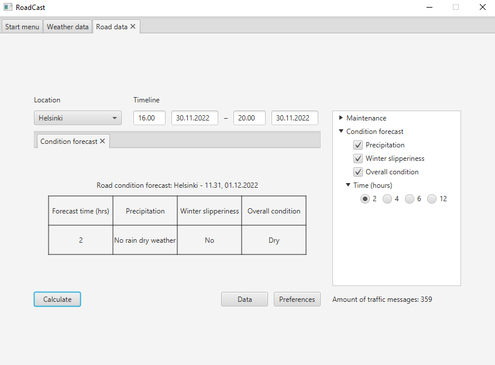
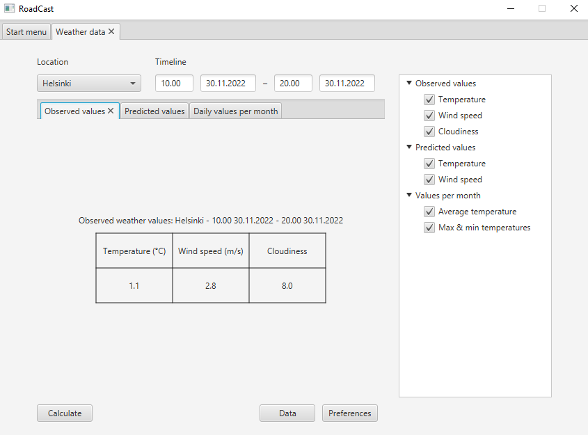
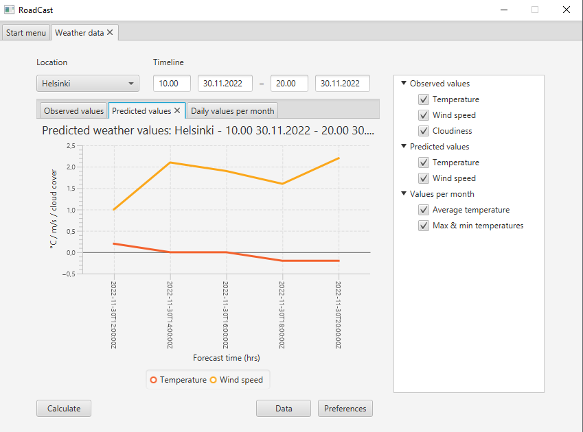
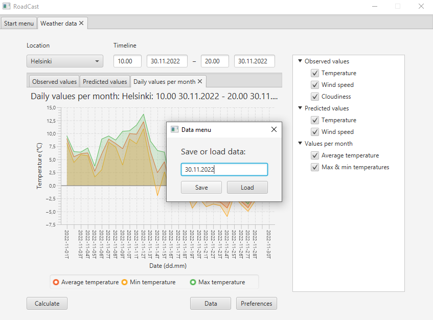
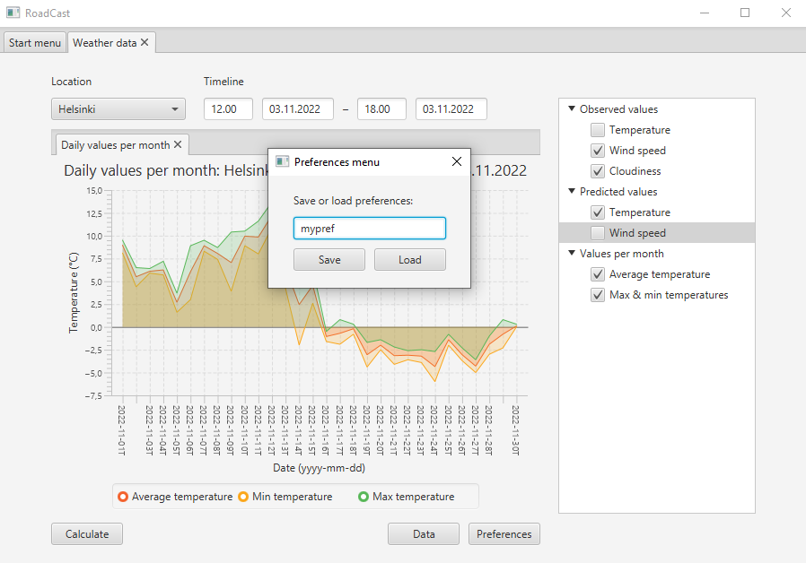

# Project RoadCast
COMP.SE.110 - Software Design - Group3\
Group assignment


## Description
A program for parsing weather and maintenance data from 
[Fintraffic](https://www.fintraffic.fi/en) and [Finnish Meteorological Institute public](https://en.ilmatieteenlaitos.fi/) 
APIs and visualizing them with in a desktop application 
\
More info for the assignment @ https://moodle.tuni.fi/pluginfile.php/2680373/mod_resource/content/0/group_assignment_specification.pdf.


### Built with
* [Java](https://www.java.com/en/)
* [JavaFX](https://openjfx.io/)

### Frameworks used
* [GSON](https://github.com/google/gson)
* [JDOM2](http://www.jdom.org/)
* [JUnit5](https://junit.org/junit5/)


## Getting started
To get your local copy up and running follow these steps

### Prerequisites
Make sure you have Java JDK installed

1. Install Java SE and Maven in Windows by downloading them from 
  ```sh
  https://www.java.com/en/
  https://maven.apache.org/download.cgi
  ```
 2. Install Java SE in linux(Ubuntu/debian based) by  
  ```sh
   sudo apt-update
   sudo apt install default-jdk
   sudo apt install default-jre
   sudo apt-get install maven
   ```


### Installation
 1. Open commandline and navigate to wanted folder and clone this repository
 ```sh
 cd /path/to/wantedfolder
 ```
 ```sh
 git clone git@course-gitlab.tuni.fi:comp-se-110-software-design_2022-2023/group-3.git nameyouwanttouse
 ```
 2. if you have the project supplied in a zip file place it to a wanted folder and unzip it with
 ```sh
 tar -xf archive.zip
 ```
 Or use the GUI to unzip the project

 3. Run the tests to check that everything is ok and compile the package
 ```sh
 mvn compile
 ```
 4. Start the program in the commandline by using
 ```sh
 java -jar Group3/target/Group3-1.0.one-jar.jar
 ```
 Or open the project in your chosen IDE compatible with Java and Maven and press run project


## Usage
 When the app is up and running you can see the mainwindow
 
 
 
 Start by selecting the data you want to view
 
 
 
 Update parameters you want to be visualized, use the full date in dd.mm.yy format
 
 

 Enjoy the visualization of either road conditions or weather data!
 If you are seeing NaN or empty visualization the data doesn't exist in FMI or Digitraffic

 

 

 Use the tabs to change the visualization

 

 

 You can also save and load data you've previously visualized

 

 Also the visualization preferences can be saved or loaded

 
 

## Contact
Amanda Dieuaide - amanda.dieuaide@tuni.fi\
Aleksi Iso-Seppälä - aleksi.iso-seppala@tuni.fi\
Jukka Pelli - jukka.pelli@tuni.fi\
Lauri Puoskari - lauri.puoskari@tuni.fi
